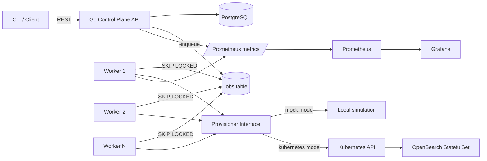

# Architecture

## Request lifecycle

1. `POST /v1/clusters` requires an idempotency key.
2. Requests sharing a key are serialized with a PostgreSQL transaction-level advisory lock.
3. API writes the cluster, immutable normalized request payload, and provisioning job in one PostgreSQL transaction.
4. Workers claim jobs with `FOR UPDATE SKIP LOCKED`, allowing multiple workers without double execution.
5. Provisioning changes cluster state `REQUESTED -> PROVISIONING -> RUNNING`.
6. Failed jobs use exponential backoff and retry up to three times before cluster state becomes `FAILED`.
7. In Kubernetes mode the provisioner reconciles a headless Service and OpenSearch StatefulSet and waits for all requested replicas to become ready.

## Lifecycle concurrency

The domain package defines the allowed state-transition graph. Worker updates use compare-and-set SQL (`WHERE status = expected`) so stale workers cannot overwrite a newer state. API lifecycle requests lock the cluster row before changing state and creating a job. A partial unique index on active jobs provides a second database-level guarantee that a cluster cannot be provisioned, scaled, and deleted concurrently.

## Deliberate v1 tradeoffs

- OpenSearch security is disabled **only for local portfolio development**.
- StatefulSet data uses `emptyDir` so Kind works without a storage provisioner. Production evolution is a StorageClass/PVC design.
- PostgreSQL is used as both metadata store and durable work queue to keep the MVP small while still demonstrating transactional job creation and concurrent consumers.
- Scale is intentionally limited to 1-3 nodes for laptop resource safety.
