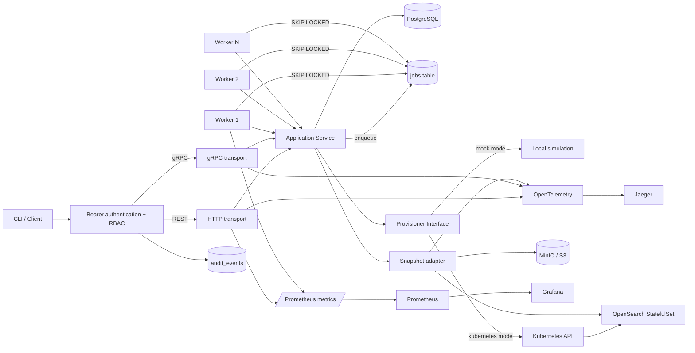

# Architecture

## Request lifecycle

1. `POST /v1/clusters` requires an idempotency key.
2. Requests sharing a key are serialized with a PostgreSQL transaction-level advisory lock.
3. API writes the cluster, immutable normalized request payload, and provisioning job in one PostgreSQL transaction.
4. Workers claim jobs with `FOR UPDATE SKIP LOCKED`, allowing multiple workers without double execution.
5. Provisioning changes cluster state `REQUESTED -> PROVISIONING -> RUNNING`.
6. Failed jobs use exponential backoff and retry up to three times before cluster state becomes `FAILED`.
7. In Kubernetes mode the provisioner reconciles an ownership-labeled headless Service and OpenSearch StatefulSet with per-replica PVCs, then waits for the desired count on the current rollout revision.
8. Backup and restore commands create durable jobs. Workers drive native OpenSearch S3 snapshot APIs and persist backup state transitions independently from cluster lifecycle state.

When shutdown cancels an in-flight operation, the service releases its job back to `PENDING` with no attempt consumed. The process waits for worker cleanup within a configured deadline. A stale-process safety net also makes `RUNNING` jobs claimable after their lease expires.

## Application boundary

REST and generated gRPC handlers translate protocol requests into application inputs and map application errors to stable HTTP responses or canonical gRPC status codes. The application service owns validation, normalization, lifecycle commands, durable job execution, and provisioner coordination. Workers only provide concurrency and polling, so behavior cannot drift between protocols.

## Lifecycle concurrency

The domain package defines the allowed state-transition graph. Worker updates use compare-and-set SQL (`WHERE status = expected`) so stale workers cannot overwrite a newer state. API lifecycle requests lock the cluster row before changing state and creating a job. A partial unique index on active jobs provides a second database-level guarantee that a cluster cannot be provisioned, scaled, and deleted concurrently.

## Security boundary

HTTP middleware and a gRPC unary interceptor authenticate bearer credentials, enforce `admin` versus `viewer` permissions, attach validated or generated request IDs, and persist success and denial events. Health, readiness, metrics, gRPC health, and reflection remain public for local orchestration. Static keys are a deliberately small local mechanism; production deployment requires external identity, TLS, secret rotation, and network policy.

## Observability path

Prometheus metrics cover request rate, in-flight HTTP work, HTTP/gRPC latency and status, active workers, job duration and outcome, and retry counts. Alert rules and a provisioned Grafana dashboard use those metrics. OpenTelemetry emits W3C-correlated HTTP, gRPC, service-job, and OpenSearch client spans over OTLP to Jaeger.

## Deliberate v1 tradeoffs

- OpenSearch security is disabled **only for local portfolio development**.
- StatefulSet data uses configurable `ReadWriteOnce` PVCs. Kind supplies the local-path `standard` StorageClass; a production installation supplies its platform StorageClass.
- PostgreSQL is used as both metadata store and durable work queue to keep the MVP small while still demonstrating transactional job creation and concurrent consumers.
- Scale is intentionally limited to 1-3 nodes for laptop resource safety.
- Deterministic failure injection is restricted to mock mode and disabled by default.
- Snapshot repositories isolate objects by cluster ID; restores rename indices instead of overwriting live data.
